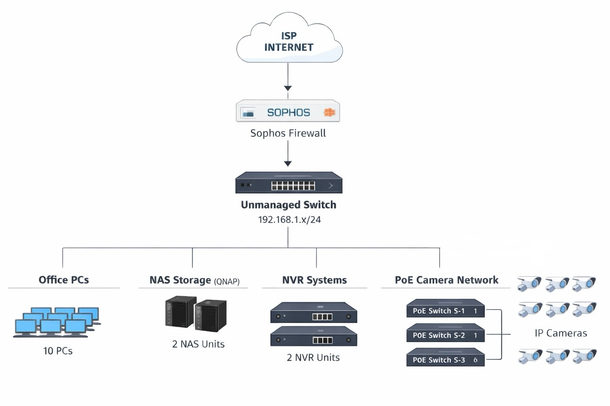

# 🔒 Project-1 — Firewall Implementation & Network Security

> **Security & Confidentiality Notice:**  
> This project was implemented in a live production environment.  
> To protect client confidentiality and infrastructure security, specific device models, internal IP allocations, credentials, and vendor-specific configurations are intentionally generalized or omitted.

---

## 📌 Project Overview

This project involved the **design, deployment, and validation of a firewall-based security architecture** for a customer’s on-premise network.  
The objective was to **enforce strict internet access control**, protect sensitive internal resources, and isolate critical systems such as **NAS storage and surveillance infrastructure**, while ensuring uninterrupted business operations.

The solution was implemented using a **Sophos Firewall** as the network perimeter security device, with all internal systems operating within a **LAN subnet (192.168.x.x/24)**.

---

## 🧱 Network Architecture Summary

### High-Level Network Flow

The following diagram represents a **high-level, sanitized view** of the deployed network architecture.
> *Diagram is a logical representation, not a physical wiring map.*

### Core Infrastructure Components

- **Firewall:** Sophos Firewall (Perimeter security, policy enforcement)
- **LAN Network:** 192.168.x.x/24
- **Switching:** Unmanaged Layer-2 Switch
- **Storage:** 2 × QNAP NAS devices
- **Surveillance Infrastructure:**
  - 2 × NVR
  - 3 × PoE Switch
  - Multiple IP cameras connected via PoE

---

## 🎯 Business & Security Objectives

- Enforce controlled and policy-based internet access
- Prevent unauthorized data transfer and data leakage
- Secure internal storage systems from external exposure
- Isolate camera infrastructure from the internet
- Allow only business-approved services and applications
- Improve overall network security posture without disrupting operations

---

## 🧩 Client Requirements

The client provided **explicit security and access requirements** to be enforced at the firewall level.

### 🌐 Internet Access Control

- Block **all data transfer and online backup websites**
  - ✅ Allow **Dropbox** as a business-approved exception
- Block access to:
  - Gaming websites
  - Gambling platforms
  - Financial and stock trading websites
- Block all social media platforms
  - ✅ Allow **WhatsApp** for business communication

---

### 🗄 NAS Security Restrictions

The environment included **two NAS devices** used exclusively for internal storage and services.

Required controls:
- ❌ Block **all WAN / internet access** to NAS devices
- ✅ Allow **LAN-only access**
- ❌ Prevent any inbound internet-originated connections
- Ensure NAS systems remain invisible from external networks

---

### 📷 Surveillance Network Restrictions

The client required strict control over camera traffic.

Required controls:
- Block **all internet access** for camera IP addresses
- Allow camera communication **only with the NVR**
- Prevent direct camera access from user PCs and external networks

---

## 🛠️ Solution Design & Implementation

The following structured approach was used to meet all client requirements.

---

### 1️⃣ Network Assessment & Planning

- Identified all network-connected devices and IP ranges
- Mapped traffic flow between:
  - Users
  - NAS devices
  - Cameras
  - NVR
  - Internet
- Designed firewall placement and access policies
- Documented required service exceptions (Dropbox, WhatsApp)

---

### 2️⃣ Firewall Deployment & Baseline Configuration

- Deployed Sophos Firewall at the network edge
- Configured:
  - WAN interface (ISP connectivity)
  - LAN interface (192.168.x.x/24)
- Established default-deny security posture
- Enabled logging and monitoring for policy validation

---

### 3️⃣ Web Content Filtering & Application Control

- Implemented category-based web filtering rules to block:
  - Data transfer and backup services
  - Gaming and gambling platforms
  - Financial and stock-related websites
  - Social media platforms
- Created explicit allow rules for:
  - Dropbox
  - WhatsApp
- Verified filtering applied consistently across all user devices

---

### 4️⃣ NAS Access Control & Traffic Isolation

- Assigned static IPs to NAS devices
- Created firewall rules to:
  - Deny all WAN-originated traffic to NAS IPs
  - Allow LAN-only access from authorized internal systems
- Prevented accidental exposure via port forwarding or NAT

---

### 5️⃣ Camera & NVR Traffic Segmentation

- Grouped all camera IP addresses into a dedicated firewall object
- Applied rules to:
  - Block all internet access for camera IPs
  - Allow camera traffic **only to the NVR**
- Ensured NVR remained accessible only from trusted internal sources

---

### 6️⃣ Testing, Validation & Handover

- Performed policy validation testing:
  - Verified blocked websites were inaccessible
  - Confirmed Dropbox and WhatsApp access worked as expected
  - Tested NAS accessibility from LAN and WAN
  - Verified cameras communicated only with the NVR
- Reviewed firewall logs for rule accuracy
- Delivered documentation and operational guidance to the client

---

## 📊 Project Outcome

- All client security requirements were successfully implemented
- Internet access was fully controlled and policy-driven
- NAS systems were protected from external threats
- Camera infrastructure was isolated and secured
- Risk of data leakage and unauthorized access was significantly reduced
- Network security posture improved without impacting daily operations

---

## 📌 Professional Notes

- Implemented in a **live production environment**
- Solution designed based on **business requirements**, not lab assumptions
- Emphasis placed on **security, stability, and maintainability**
- Architecture allows for future scalability and policy expansion

📎 *This project represents real-world firewall and network security implementation in an operational environment.*
