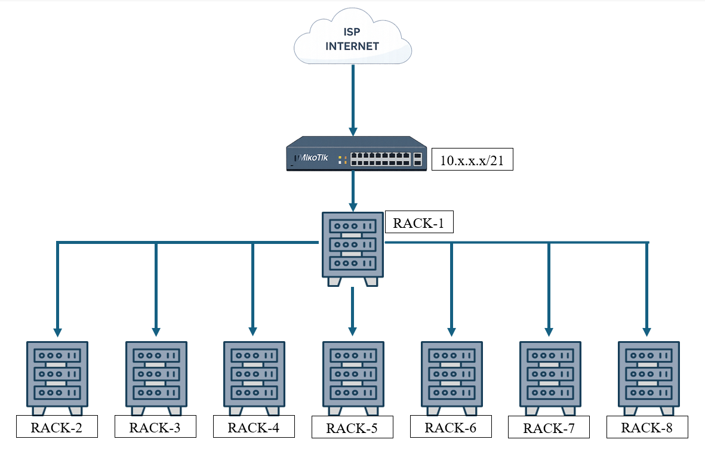

# 📶 Project-2 — Underground Parking Wi-Fi Calling & Wireless Coverage Solution

> **Security & Confidentiality Notice:**  
> This project was implemented in a live customer environment.  
> Exact device models, IP schemes, credentials, and site identifiers have been generalized to maintain confidentiality while preserving the technical architecture and solution approach.

---

## 📌 Project Overview

This project involved delivering a **reliable wireless connectivity solution** for a **two-level underground parking facility** where users were experiencing **complete loss of mobile network coverage**, resulting in failed voice calls and poor data connectivity.

To address this issue, a **Wi-Fi Calling–based solution** was designed and implemented using enterprise-grade wireless infrastructure.  
The solution ensured **stable voice calling, controlled internet access, and uniform wireless coverage** across both underground parking levels.

---

## 🎯 Business & Technical Challenges

- No cellular signal in underground parking levels
- Users unable to make or receive voice calls
- Requirement for seamless connectivity without installing cellular repeaters
- High device density during peak hours
- Need for bandwidth control per user
- Large physical area requiring structured cabling and scalability

---

## 🧩 Client Requirements

The client requested a solution that would:

- Enable **Wi-Fi Calling** for voice communication
- Provide **full wireless coverage** across two underground parking levels
- Support a **large number of concurrent users**
- Enforce **bandwidth limitation (10 Mbps per device)**
- Use a **centralized and scalable network design**
- Ensure minimal maintenance and high availability

---

## 🧱 Network Architecture Overview

### High-Level Network Flow

The following diagram represents a **high-level, sanitized view** of the deployed network architecture.
> *Diagram is a logical representation, not a physical wiring map.*

---

### Infrastructure Design Summary

- **Router:** MikroTik (Gateway, bandwidth control, routing)
- **Core Rack:** Rack-1 (central aggregation point)
- **Distribution:** Fiber backbone from Rack-1 to all other racks
- **Switching:**
  - 1 × SFP switch supporting fiber connections (core)
  - PoE switches installed in each rack
- **Wireless:**
  - 50 × TP-Link Access Points
  - APs distributed across two underground parking levels
- **Access Method:** Wi-Fi Calling via client mobile devices

---

## 🛠️ Solution Design & Implementation

---

### 1️⃣ Site Survey & Wireless Planning

- Conducted RF and physical site assessment
- Identified signal dead zones across both parking levels
- Determined optimal AP placement for uniform coverage
- Calculated AP density to support concurrent users

---

### 2️⃣ Core Network Setup

- Configured MikroTik router as:
  - Internet gateway
  - Traffic controller
  - Bandwidth management device
- Established uplink from ISP to MikroTik router
- Connected MikroTik router to **Rack-1 (core rack)**

---

### 3️⃣ Fiber Backbone & Rack Interconnection

- Implemented fiber connectivity from **Rack-1 to Rack-2 through Rack-8**
- Used an **SFP-enabled switch** for fiber termination and aggregation
- Ensured high-speed, low-latency backbone between racks
- Designed star topology with Rack-1 as central distribution point

---

### 4️⃣ PoE Switching & Access Point Deployment

- Installed PoE switches in each rack
- Connected nearby access points to the closest PoE switch
- Reduced copper cable lengths and simplified maintenance
- Deployed a total of **50 TP-Link access points** across both parking levels

---

### 5️⃣ Wireless Configuration & Optimization

- Configured SSIDs optimized for:
  - Wi-Fi Calling compatibility
  - Seamless roaming between access points
- Adjusted transmit power to minimize interference
- Ensured uniform signal coverage across all parking areas

---

### 6️⃣ Bandwidth Management & Traffic Control

- Implemented **per-device bandwidth limitation**
  - 📉 **10 Mbps maximum per device**
- Prevented bandwidth abuse
- Ensured fair usage during peak hours
- Maintained voice call quality under load

---

### 7️⃣ Testing & Validation

- Verified Wi-Fi Calling functionality across both parking levels
- Tested call quality and handoff between access points
- Conducted load testing with multiple concurrent devices
- Validated bandwidth limits per client device
- Confirmed redundancy and stability of fiber backbone

---

## 📊 Project Outcome

- Full wireless coverage achieved across underground parking
- Users successfully able to make and receive calls using Wi-Fi Calling
- Stable internet connectivity for mobile devices
- Bandwidth evenly distributed with no single-user congestion
- Scalable infrastructure ready for future expansion
- Client satisfaction achieved with minimal ongoing maintenance

---

## 📌 Professional Notes

- Implemented in a **live production environment**
- Solution designed around **real-world constraints**
- Emphasis on **coverage, reliability, and user experience**
- Architecture supports future AP expansion and rack additions
- Wi-Fi Calling chosen as a cost-effective alternative to cellular repeaters

📎 *This project demonstrates real-world wireless infrastructure design and deployment in challenging environments.*

